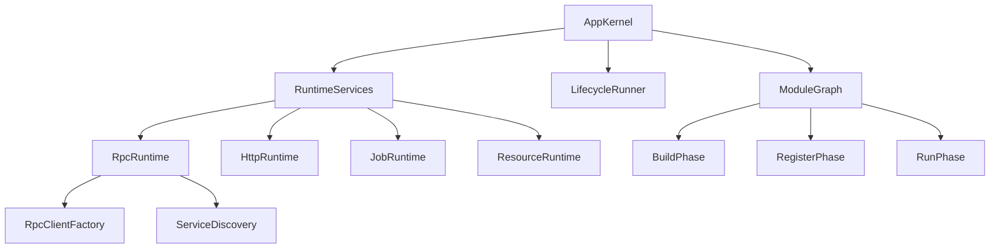

# Octopus

Octopus 是一个面向 Go 服务的轻量运行时框架，聚焦三件事：

- 统一应用生命周期（RPC / HTTP / Job）
- etcd 服务发现与 gRPC 客户端接入
- 可组合的模块化启动方式（phase-based `Module`）

## 设计哲学

**框架负责编排，模块负责业务，让边界清晰、依赖显式、生命周期自然。**

这句话对应四条实现约束：

- `App` 负责编排启动顺序、关闭顺序和共享运行时能力
- 模块只表达自己的业务构建、服务注册和运行逻辑
- 每个阶段只暴露当下需要的能力，避免给模块一个过宽的入口
- 依赖关系通过接口和显式装配流动，而不是通过模块之间直接耦合

### V2 层次图



这张图表达的是 V2 的核心边界：

- `pkg/app` 更像一个 `AppKernel`，负责模块图和生命周期编排
- 具体的 RPC / HTTP / Job / Resource 能力由独立 `Runtime` 提供
- `RpcRuntime` 内部再拆分出 client factory 和 service discovery，而不是让 `App` 自己处理这些细节

## 安装

```bash
go get github.com/HorseArcher567/octopus
```

## 快速开始

### 1. 运行示例服务

```bash
cd examples/multi-service/server
cp .env.example .env
export $(grep -v '^#' .env | xargs)
go run ./cmd/server -config configs/config.dev.yaml
```

### 2. 运行示例客户端

```bash
go run ./examples/multi-service/client \
  -config examples/multi-service/client/config.yaml \
  -target etcd:///multi-service-demo \
  -api http://127.0.0.1:8090/hello
```

### 3. 运行最小示例

```bash
cd examples/hello-module
go run . -config config.yaml
```

## 核心抽象

```go
type Module interface {
    ID() string
}

type DependentModule interface {
    DependsOn() []string
}

type BuildModule interface {
    Build(ctx context.Context, b BuildContext) error
}

type RegisterRPCModule interface {
    RegisterRPC(ctx context.Context, r RPCRegistrar) error
}

type RegisterHTTPModule interface {
    RegisterHTTP(ctx context.Context, r HTTPRegistrar) error
}

type CloseModule interface {
    Close(ctx context.Context) error
}
```

- `ID`: 模块唯一标识
- `DependsOn`: 可选依赖声明
- `Build`: 构建依赖与装配业务对象
- `RegisterRPC` / `RegisterHTTP`: 注册对外入口
- `Close`: 关闭阶段回收（逆序执行）

## Phase 能力

模块按阶段获取受限能力，不直接依赖 `*App`：

- `BuildContext`: `Logger()` / `MySQL(name)` / `Redis(name)` / `RPCClient(target)` / `Container`
- `RPCRegistrar`: `Logger()` / `Resolver` / `RegisterRPC(...)`
- `HTTPRegistrar`: `Logger()` / `Resolver` / `RegisterHTTP(...)`
- `JobRegistrar`: `Logger()` / `Resolver` / `AddJob(...)`

### RPC 客户端复用

- `NewRPCClient(target)` 会按 `target` 复用连接。
- 相同 `target` 多次调用返回同一个 `*grpc.ClientConn`。
- 框架在 `App` 关闭阶段自动调用 `CloseRpcClients()` 统一释放连接。
- 如果业务在运行期主动调用 `CloseRpcClients()`，后续再调用 `NewRPCClient(target)` 会创建新连接。

## 应用入口示例

```go
app.MustRun(configFile, []app.Module{
    bootstrap.NewInfraModule(),
    bootstrap.NewServiceModule(),
    bootstrap.NewRPCModule(),
    bootstrap.NewAPIModule(),
})
```

其中：

- `infra` 模块初始化数据库并构建仓储
- `service` 模块消费仓储并构建业务服务
- `rpc` 模块消费服务并注册 gRPC 服务
- `api` 模块注册 HTTP 路由

`examples/multi-service` 展示的是“一个进程内承载多个业务服务”的参考实现；
如果你想先理解最小心智模型，优先看 `examples/hello-module`。

## 项目结构

```text
octopus/
├── pkg/
│   ├── app/        # 生命周期与模块运行时
│   ├── rpc/        # gRPC server/client + etcd 注册发现
│   ├── api/        # HTTP API server (gin)
│   ├── resource/   # MySQL/Redis 资源管理
│   ├── config/     # 配置加载
│   └── xlog/       # 日志
├── examples/
│   ├── hello-module/
│   └── multi-service/
│       ├── server/
│       └── client/
└── cmd/
    └── octopus-cli/
```

## 测试

```bash
GOCACHE=/tmp/go-build go test ./...
```

## 许可证

MIT
